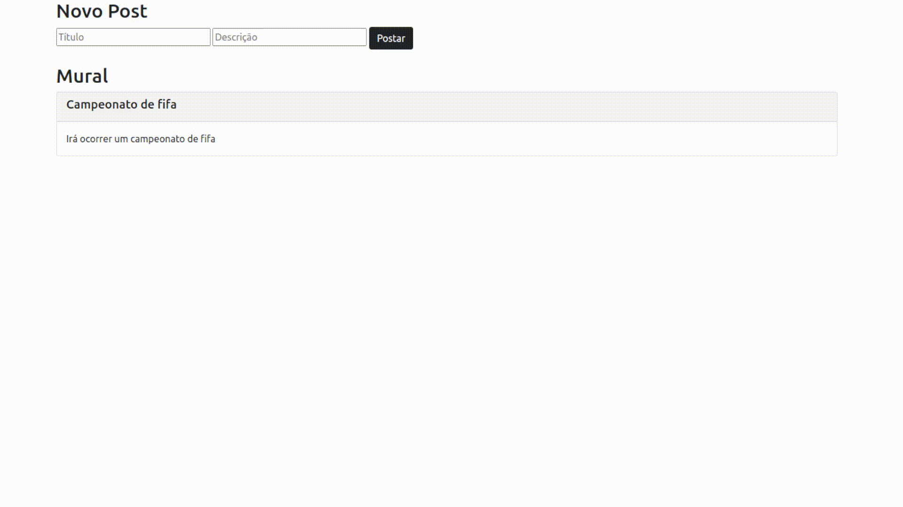

# Mural de Avisos

## Objetivo do repositório

Esse repositório é referente a aplicação construída durante o curso do Progrmador-BR. O intuito desse app, é aprender algumas boas práticas de comunicação entre FRONTend e BACKEND.

---
## Objetivo do APP

Iremos criar um mural, em que diferentes usuários podem criar "posts" para que outros usuários possam acompanhar. De maneira resumida, o app leva a ideia cnetral do Twitter como referência.

---
## Metodologia

A aplicação foi iniciada construindo seu backend, que basicamente consiste em uma API bem básica, a qual nos permite criar e listar os posts. Dessa forma, construímos as rotas e suas requisições, testando o funcionamento da API com o Insomnia. 

No frontend, foi construído uma estrutura HTML básica e sua estilização foi feita com Bootstrap. Para fazer a comunicação entre a camada do client e do servidor, foi utilizado o método fetch no script ([confira aqui](public/scripts/script.js)) que conecta com a URL da API e busca as informações gravadas no servidor.

---

## Tecnologias utilizadas

### Frontend:
- HTML
- CSS
- JavaScript
- Bootstrap

### Backend
- Node.JS
- Express

### Outras
- Insomnia

---
## A aplicação em funcionamento

  

## Entre em contato comigo

